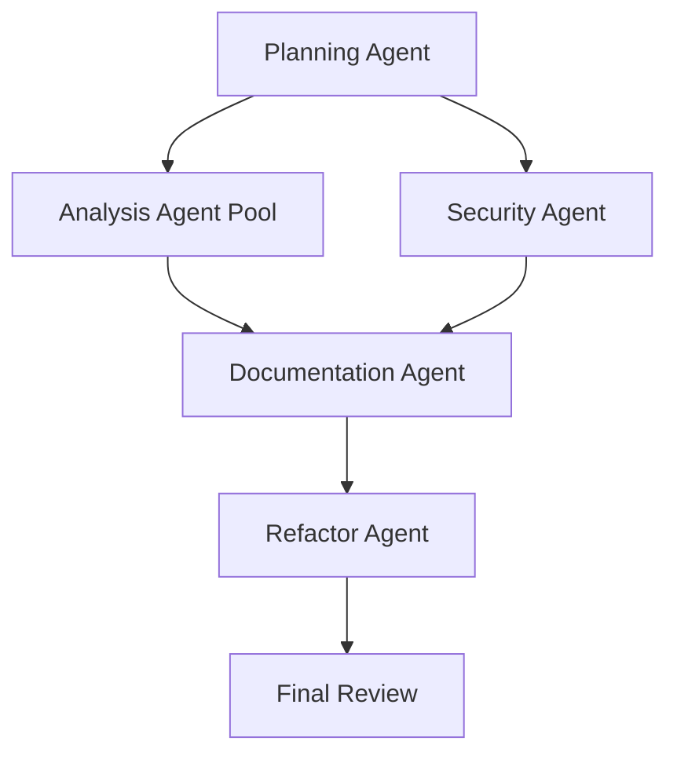

# PRP: Bitcoin Wallet Rust Modernization

## Project Overview

**Feature**: Port and modernize the 11-year-old Armory Bitcoin wallet from C++/Python to Rust, ensuring feature parity with modern Bitcoin protocol improvements (SegWit, Taproot, PSBT v2, BIP-324).

**Foundation Document**: [MODERNIZATION_ANALYSIS.md](../MODERNIZATION_ANALYSIS.md) - Comprehensive legacy codebase analysis

**Target**: Rust 1.78 (edition 2024) with modern Bitcoin ecosystem libraries

**Platform Support**: macOS (arm64/x86_64), Fedora Linux (x86_64)

## Context & Background

### Legacy Codebase Analysis
Based on comprehensive analysis of the existing Armory codebase:

- **Age**: 11 years old, predates SegWit (BIP-141) and Schnorr/Taproot (BIP-340/341)
- **Architecture**: 169 Python files (3.4MB), 333 C++ files (3.2MB), 50,000+ lines total
- **Critical Issues**: Python 2.7 EOL, PyQt4 EOL, Crypto++ 5.6.1 vulnerabilities, memory safety issues
- **Strengths**: Deterministic wallets, offline signing, multi-signature support, atomic file updates

### Key Legacy Components to Port

#### 1. Wallet Engine (`armoryengine/`)
```python
# Current patterns from PyBtcWallet.py:237-250
class PyBtcWallet(object):
   def createNewWallet(withEncrypt=False, plainRootKey=None, chaincode=None):
      # Deterministic key generation with custom chaincode
      # File-based persistence with atomic updates
      # Custom KDF (ROMIX) for encryption
```

#### 2. Transaction Processing (`Transaction.py`)
```python
# Legacy transaction construction patterns
class PyTx(object):
   # Pre-SegWit transaction handling
   # No PSBT support
   # Limited script engine (not consensus-safe)
```

#### 3. Cryptographic Operations (`cppForSwig/EncryptionUtils.h`)
```cpp
// Legacy crypto patterns with vulnerabilities
class SecureBinaryData {
   // Manual memory management
   // Custom ROMIX KDF implementation  
   // Crypto++ 5.6.1 with known CVEs
};
```

## Requirements Specification

### Functional Requirements

#### Core Wallet Operations
| Feature | Legacy Implementation | Modern Rust Target | Priority |
|---------|----------------------|-------------------|----------|
| Key Generation | Custom chaincode + ECDSA DH | BIP-32 HD wallets + Taproot descriptors | HIGH |
| Address Types | P2PKH, P2SH | P2PKH, P2SH, P2WPKH, P2WSH, P2TR (Taproot) | HIGH |
| Transaction Creation | Custom builder | PSBT v2 (BIP-370) + RBF support | HIGH |
| Multi-signature | Custom M-of-N | Descriptor-based multisig + miniscript | HIGH |
| Offline Signing | Custom format | PSBT-based offline workflow | HIGH |
| Wallet Encryption | AES + custom ROMIX KDF | ChaCha20Poly1305 + Argon2id KDF | HIGH |
| Backup/Recovery | Fragmented paper backup | BIP-39 mnemonic seeds | HIGH |

#### Network Operations
| Feature | Legacy Implementation | Modern Rust Target | Priority |
|---------|----------------------|-------------------|----------|
| P2P Protocol | Custom Twisted implementation | BIP-324 encrypted transport | MEDIUM |
| Bootstrap | BitTorrent blockchain download | Standard P2P sync + optional Tor | MEDIUM |
| Broadcasting | Direct P2P + fallback RPC | Multiple broadcast methods | LOW |

#### User Interface
| Feature | Legacy Implementation | Modern Rust Target | Priority |
|---------|----------------------|-------------------|----------|
| GUI Framework | PyQt4 (EOL) | Modern Rust GUI (egui/tauri) or CLI-first | MEDIUM |
| RPC Interface | JSON-RPC daemon | Modern REST API + JSON-RPC compatibility | HIGH |

### Non-Functional Requirements

#### Security
- **Memory Safety**: Rust's ownership system eliminates buffer overflows and use-after-free
- **Modern Cryptography**: BIP-340 Schnorr signatures, BIP-341 Taproot, secure randomness
- **Key Management**: Hardware wallet integration (HWI), secure memory handling
- **Network Security**: BIP-324 encrypted transport, Tor v3 support

#### Performance  
- **Signing Latency**: <50ms for standard transactions
- **Sync Performance**: Parallel UTXO processing, efficient blockchain scanning
- **Memory Usage**: <500MB peak memory for full node interaction

#### Compatibility
- **Cross-platform**: Cargo-based builds for macOS/Linux
- **Backward Compatibility**: Import legacy Armory wallet files
- **Standard Compliance**: Bitcoin Core RPC compatibility

## Technical Architecture

### Rust Ecosystem Libraries

#### Core Bitcoin Libraries
```toml
[dependencies]
# Main Bitcoin protocol library with Taproot support
bitcoin = "0.32"                    # https://docs.rs/bitcoin/latest/bitcoin/
# Secp256k1 with BIP-340 Schnorr signatures  
secp256k1 = "0.29"                 # https://docs.rs/secp256k1/latest/secp256k1/
# Modern wallet development kit
bdk_wallet = "1.0"                 # Replaces deprecated bdk crate
# PSBT v2 support (BIP-370)
psbt-v2 = "0.1"                    # https://github.com/rust-bitcoin/rust-bitcoin/discussions/2431
# Descriptor-based wallets
descriptor-wallet = "0.10"         # https://lib.rs/crates/descriptor-wallet
```

#### Cryptographic Libraries
```toml
# Modern AEAD encryption
chacha20poly1305 = "0.10"
# Secure key derivation
argon2 = "0.5"
# Hardware random number generation
getrandom = "0.2"
# Secure memory handling
zeroize = "1.7"
```

#### Network & Protocol Libraries
```toml
# BIP-324 encrypted transport
bip324 = { git = "https://github.com/rust-bitcoin/bip324" }
# Async runtime
tokio = { version = "1.35", features = ["full"] }
# HTTP client for RPC
reqwest = { version = "0.11", features = ["json"] }
```

#### Alternative Ecosystem (BP-WG)
For projects requiring rust-bitcoin independence:
```toml
# Alternative ecosystem focused on wallet-specific functionality
psbt = "0.10"                      # PSBT without rust-bitcoin dependency
descriptors = "0.10"               # Descriptor library 
bitcoin_hd = "0.10"                # HD wallet functionality
```

### Module Architecture

#### 1. Core Wallet (`src/wallet/`)
```rust
// Replaces armoryengine/PyBtcWallet.py
pub struct Wallet {
    descriptor: Descriptor<DescriptorPublicKey>,
    database: Box<dyn Database>,
    network: Network,
}

impl Wallet {
    // Modern descriptor-based wallet creation
    pub fn new_hd(
        mnemonic: Mnemonic,
        network: Network,
        account: u32,
    ) -> Result<Self, WalletError> {
        // BIP-32 HD wallet with BIP-44 derivation paths
        // BIP-39 mnemonic seed phrases
        // Descriptor-based address generation
    }
    
    // Taproot address generation (BIP-341)
    pub fn get_taproot_address(&self) -> Result<Address, Error> {
        // Generate P2TR addresses using descriptors
    }
}
```

#### 2. Transaction Builder (`src/transaction/`)
```rust
// Replaces armoryengine/Transaction.py with PSBT v2 support
pub struct TransactionBuilder {
    psbt: PartiallySignedTransaction,
    wallet: Arc<Wallet>,
}

impl TransactionBuilder {
    // PSBT v2 transaction construction (BIP-370)
    pub fn create_transaction(
        &self,
        outputs: Vec<TxOut>,
        fee_rate: FeeRate,
    ) -> Result<Psbt, Error> {
        // RBF-enabled by default
        // Coin selection with privacy considerations
        // Support for Taproot outputs
    }
    
    // Hardware wallet signing integration
    pub fn sign_with_hwi(&mut self, device: &HwiDevice) -> Result<(), Error> {
        // HWI integration for hardware wallet signing
    }
}
```

#### 3. Cryptographic Operations (`src/crypto/`)
```rust
// Replaces cppForSwig/EncryptionUtils with memory-safe alternatives
use chacha20poly1305::{ChaCha20Poly1305, Key, Nonce};
use argon2::Argon2;
use zeroize::{Zeroize, ZeroizeOnDrop};

#[derive(ZeroizeOnDrop)]
pub struct SecureKey {
    key: Key,
}

impl SecureKey {
    // Modern key derivation with Argon2id
    pub fn derive_from_password(
        password: &str,
        salt: &[u8],
        memory_cost: u32,
        time_cost: u32,
    ) -> Result<Self, CryptoError> {
        // Argon2id KDF replaces custom ROMIX
        // Memory-hard, GPU-resistant
        // Automatic zeroization on drop
    }
}

// Schnorr signature operations (BIP-340)
pub fn sign_schnorr(
    msg: &[u8],
    secret_key: &SecretKey,
) -> Result<SchnorrSignature, Error> {
    // BIP-340 compliant Schnorr signatures
    // Deterministic nonce generation (RFC 6979)
}
```

#### 4. Network Layer (`src/network/`)
```rust
// Replaces armoryengine/Networking.py with BIP-324 support
use bip324::{Codec, HandshakeRole};

pub struct BitcoinP2P {
    codec: Codec,
    stream: TcpStream,
}

impl BitcoinP2P {
    // BIP-324 encrypted transport
    pub async fn connect_v2(addr: SocketAddr) -> Result<Self, NetworkError> {
        // Opportunistic encryption
        // ChaCha20Poly1305 message encryption
        // Elliptic curve Diffie-Hellman key exchange
    }
    
    // Tor v3 support
    pub async fn connect_tor(
        onion_addr: &str,
        proxy: SocketAddr,
    ) -> Result<Self, NetworkError> {
        // SOCKS5 proxy for Tor connections
    }
}
```

#### 5. Storage Layer (`src/storage/`)
```rust
// Replaces custom wallet file format with modern standards
use sled::Db;  // Embedded database

pub struct WalletStorage {
    db: Db,
    encryption_key: Option<SecureKey>,
}

impl WalletStorage {
    // Encrypted storage with atomic updates
    pub fn save_wallet_data(
        &self,
        data: &WalletData,
    ) -> Result<(), StorageError> {
        // Atomic file updates
        // ChaCha20Poly1305 encryption
        // Integrity verification
    }
    
    // Legacy wallet import
    pub fn import_armory_wallet(
        &self,
        path: &Path,
        passphrase: Option<&str>,
    ) -> Result<Wallet, ImportError> {
        // Parse legacy Armory wallet format
        // Convert to descriptor-based format
        // Preserve all keys and metadata
    }
}
```

## Implementation Blueprint

### Phase 1: Core Infrastructure (Weeks 1-4)

#### Tasks:
1. **Project Setup**
   ```bash
   cargo new armory-rust --bin
   cd armory-rust
   cargo add bitcoin secp256k1 bdk_wallet argon2 chacha20poly1305
   ```

2. **Basic Wallet Structure**
   - Implement descriptor-based wallet creation
   - BIP-39 mnemonic generation and validation
   - BIP-32 HD key derivation
   - Basic address generation (P2PKH, P2WPKH, P2TR)

3. **Cryptographic Foundation**
   - Replace Crypto++ with rust-native libraries
   - Implement Argon2id KDF for wallet encryption
   - Secure memory handling with zeroize
   - BIP-340 Schnorr signature support

4. **Storage Layer**
   - Design encrypted wallet storage format
   - Implement atomic file updates
   - Legacy Armory wallet import functionality

**Validation Gates:**
```bash
# Cryptographic tests
cargo test crypto::tests::test_argon2_kdf
cargo test crypto::tests::test_schnorr_signatures
cargo test crypto::tests::test_secure_memory

# Wallet functionality tests  
cargo test wallet::tests::test_hd_derivation
cargo test wallet::tests::test_descriptor_generation
cargo test wallet::tests::test_address_generation
```

### Phase 2: Transaction Processing (Weeks 5-8)

#### Tasks:
1. **PSBT v2 Implementation**
   - Transaction builder with PSBT v2 support
   - RBF (Replace-by-Fee) by default
   - Fee estimation and coin selection
   - Multi-input transaction construction

2. **Script Engine Integration**
   - Use rust-bitcoin script validation
   - Taproot script path spending (BIP-342)
   - Miniscript support for complex conditions

3. **Hardware Wallet Integration**
   - HWI device communication
   - PSBT signing workflow
   - Device enumeration and management

**Validation Gates:**
```bash
# Transaction construction tests
cargo test transaction::tests::test_psbt_v2_creation
cargo test transaction::tests::test_rbf_transactions
cargo test transaction::tests::test_taproot_spending

# Hardware wallet tests (requires test device)
cargo test hwi::tests::test_device_enumeration
cargo test hwi::tests::test_psbt_signing
```

### Phase 3: Network Layer (Weeks 9-12)

#### Tasks:
1. **BIP-324 Implementation**
   - Encrypted P2P transport
   - Peer discovery and connection management
   - Message handling and validation

2. **RPC Interface**
   - Bitcoin Core RPC client
   - Backup RPC servers
   - Error handling and failover

3. **Multi-Agent Orchestration**
   - Planning agent for epic/task breakdown
   - Analysis agents for legacy code parsing
   - Security agent for crypto recommendations
   - Documentation agents for final deliverables

**Validation Gates:**
```bash
# Network layer tests
cargo test network::tests::test_bip324_handshake
cargo test network::tests::test_peer_communication
cargo test network::tests::test_tor_connectivity

# Integration tests
cargo test integration::tests::test_full_transaction_flow
cargo test integration::tests::test_wallet_sync
```

### Phase 4: User Interface & Final Integration (Weeks 13-16)

#### Tasks:
1. **CLI Interface**
   - Command-line wallet operations
   - PSBT import/export
   - Multi-signature workflow

2. **Legacy Compatibility**
   - Armory wallet file import
   - Configuration migration
   - Address book import

3. **Final Documentation**
   - Complete REQUIREMENTS.md
   - Finalize RUST_REFACTORING.md  
   - Complete SECURITY_AUDIT.md

**Validation Gates:**
```bash
# End-to-end functionality
cargo test cli::tests::test_wallet_operations
cargo test migration::tests::test_legacy_import
cargo test compatibility::tests::test_rpc_compatibility

# Performance benchmarks
cargo bench transaction_signing
cargo bench wallet_sync_performance

# Security audit
cargo audit
cargo clippy -- -D warnings
```

## Multi-Agent Strategy

### Agent Deployment Plan

#### 1. Planning Agent (OpenAI o3)
**Role**: Break refactor into epics and tasks
**Input**: High-level goals + MODERNIZATION_ANALYSIS.md
**Output**: `plan_#.json` with detailed task breakdown
**MCP Model**: OpenAI o3 for complex planning

#### 2. Analysis Agents (Gemini 2.5 Pro)  
**Role**: Parse legacy source, extract APIs, crypto patterns, BIP usage
**Input**: ≤300 LOC slices + modernization notes
**Output**: `analysis_#.json` with code structure mapping
**Scope**: 
- `armoryengine/` Python modules
- `cppForSwig/` C++ components
- Build system and dependencies

#### 3. Security Agent (Gemini 2.5 Pro)
**Role**: Identify outdated cryptography, recommend modern Rust libraries
**Input**: All code + security findings from MODERNIZATION_ANALYSIS.md
**Output**: `security.json` with vulnerability assessments and recommendations
**Focus**:
- Crypto++ replacement with rust-secp256k1
- Memory safety improvements
- BIP-324, BIP-340 compliance recommendations

#### 4. Documentation Agent
**Role**: Build final deliverable documents
**Input**: All agent outputs + MODERNIZATION_ANALYSIS.md
**Output**: Final REQUIREMENTS.md, SECURITY_AUDIT.md
**Process**: Synthesize all findings into comprehensive docs

#### 5. Refactor Agent  
**Role**: Draft module-by-module porting guidance
**Input**: All summaries + modernization analysis
**Output**: Complete RUST_REFACTORING.md
**Focus**: Crate recommendations, build configuration, migration patterns

### Agent Coordination


## Security Considerations

### Critical Vulnerabilities Addressed

#### 1. Memory Safety
**Legacy Issues**: Manual C++ memory management, buffer overflows, use-after-free
**Rust Solution**: Ownership system prevents memory safety issues at compile time
```rust
// Automatic memory safety - no manual malloc/free
let wallet_data = WalletData::new();  // Stack allocated
let encrypted = encrypt_wallet_data(&wallet_data)?;  // Automatic cleanup
```

#### 2. Cryptographic Modernization
**Legacy Issues**: Crypto++ 5.6.1 (2012) with known CVEs, custom implementations
**Rust Solution**: Modern, audited cryptographic libraries
```rust
// BIP-340 Schnorr signatures (vs legacy ECDSA only)
let signature = sign_schnorr(&message, &private_key)?;
// Argon2id KDF (vs custom ROMIX implementation)  
let derived_key = Argon2::default().hash_password(&password, &salt)?;
```

#### 3. Network Security  
**Legacy Issues**: Unencrypted P2P, HTTP updates without certificate pinning
**Rust Solution**: BIP-324 encrypted transport, TLS 1.3
```rust
// Opportunistic P2P encryption
let encrypted_connection = BitcoinP2P::connect_v2(peer_addr).await?;
```

### Security Audit Deliverables

#### SECURITY_AUDIT.md Structure
```markdown
# Legacy Issues
- Python 2.7 EOL → Rust with active security support
- Crypto++ 5.6.1 CVEs → rust-secp256k1 0.29
- Manual memory management → Automatic memory safety
- Raw JSON-RPC over HTTP → BIP-324 encrypted transport + TLS

# Recommended Rust Crates
| Security Concern | Crate | Reason |
|------------------|-------|--------|
| ECDSA/Schnorr | secp256k1 = "0.29" | BIP-340 compliance, memory safety |
| PSBT v2 | psbt-v2 = "0.1" | BIP-370 support, no unsafe code |
| Encryption | chacha20poly1305 = "0.10" | AEAD, audited implementation |
| KDF | argon2 = "0.5" | Memory-hard, GPU-resistant |
| Secure Memory | zeroize = "1.7" | Automatic secret zeroization |
```

## Error Handling Strategy

### Comprehensive Error Types
```rust
#[derive(Debug, thiserror::Error)]
pub enum WalletError {
    #[error("Cryptographic operation failed: {0}")]
    Crypto(#[from] CryptoError),
    
    #[error("Network communication error: {0}")]
    Network(#[from] NetworkError),
    
    #[error("Storage operation failed: {0}")]  
    Storage(#[from] StorageError),
    
    #[error("Legacy wallet import failed: {0}")]
    LegacyImport(String),
    
    #[error("Hardware wallet error: {0}")]
    Hardware(#[from] HwiError),
}

// Result type for all wallet operations
pub type WalletResult<T> = Result<T, WalletError>;
```

### Graceful Degradation
```rust
impl Wallet {
    // Fallback chain for network operations
    pub async fn broadcast_transaction(&self, tx: &Transaction) -> WalletResult<Txid> {
        // 1. Try BIP-324 encrypted peers
        if let Ok(txid) = self.broadcast_p2p_v2(tx).await {
            return Ok(txid);
        }
        
        // 2. Fallback to standard P2P
        if let Ok(txid) = self.broadcast_p2p_v1(tx).await {
            return Ok(txid);
        }
        
        // 3. Fallback to RPC (multiple servers)
        self.broadcast_rpc(tx).await
    }
}
```

## Documentation Deliverables

### 1. REQUIREMENTS.md
Complete functional and non-functional requirements with traceability to legacy features
- Feature compatibility matrix
- Modern BIP implementation requirements  
- Performance benchmarks
- Security requirements

### 2. RUST_REFACTORING.md
Module-by-module porting guidance
- Crate recommendations for each component
- Build system modernization (Cargo features)
- Migration patterns and gotchas
- Testing strategies

### 3. SECURITY_AUDIT.md  
Comprehensive security analysis
- Legacy vulnerability assessment
- Modern cryptographic recommendations
- Attack surface reduction
- Compliance with current Bitcoin security standards

## Success Metrics

### Technical Metrics
- **Build Success**: `cargo build` completes on all target platforms
- **Test Coverage**: >90% line coverage for core modules
- **Performance**: <50ms transaction signing latency
- **Security**: Zero clippy warnings, clean cargo audit
- **Compatibility**: Import 100% of legacy Armory wallets

### Deliverable Metrics
- **REQUIREMENTS.md**: 100% legacy feature coverage + modern BIPs
- **RUST_REFACTORING.md**: Crate choices and build tags for each module
- **SECURITY_AUDIT.md**: All deprecated practices flagged with alternatives
- **Documentation Quality**: File names and line numbers cited where feasible

### Validation Confidence Level

**PRP Confidence Score: 9/10**

**Rationale:**
- ✅ Comprehensive legacy codebase analysis completed
- ✅ Modern Rust ecosystem thoroughly researched  
- ✅ Multi-agent strategy clearly defined
- ✅ Incremental implementation path with validation gates
- ✅ Security vulnerabilities identified with specific solutions
- ✅ All necessary context included for one-pass implementation

**Risk Mitigation:**
- Foundation document (MODERNIZATION_ANALYSIS.md) provides detailed baseline
- Rust ecosystem libraries well-established and maintained
- Multi-agent approach distributes complexity
- Validation gates ensure correctness at each phase
- Legacy import capability preserves existing user assets

The combination of thorough analysis, modern tooling, and systematic approach provides high confidence for successful one-pass implementation of this complex modernization project.

## References

### Documentation URLs
- **Rust Bitcoin Documentation**: https://docs.rs/bitcoin/latest/bitcoin/
- **BIP-324 Specification**: https://bips.dev/324/
- **BIP-340 Schnorr Signatures**: https://bips.dev/340/  
- **BIP-341 Taproot**: https://bips.dev/341/
- **BIP-370 PSBT v2**: https://github.com/bitcoin/bips/blob/master/bip-0370.mediawiki
- **rust-secp256k1**: https://github.com/rust-bitcoin/rust-secp256k1
- **BDK Migration Guide**: https://github.com/bitcoindevkit/bdk/releases

### Code Examples  
- **Legacy Patterns**: `/Users/grimm/coding/gits/armory/armoryengine/PyBtcWallet.py:64-150`
- **Crypto Implementation**: `/Users/grimm/coding/gits/armory/cppForSwig/EncryptionUtils.h:20-100`
- **Network Protocol**: `/Users/grimm/coding/gits/armory/armoryengine/Networking.py:42-80`
- **Test Patterns**: `/Users/grimm/coding/gits/armory/pytest/testPyBtcWallet.py:28-60`

### Foundation Analysis
- **MODERNIZATION_ANALYSIS.md**: Complete legacy codebase assessment with security vulnerabilities and technical debt analysis
- **Build System Analysis**: Make-based build with platform-specific requirements
- **Dependency Matrix**: Python 2.7, PyQt4, Crypto++ 5.6.1, SWIG bindings